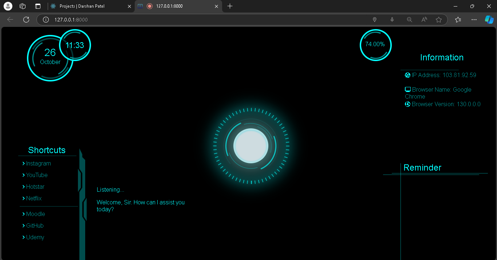

# Firday Voice Assistant



**Firday Voice Assistant** is a Django-based web application that processes voice input to respond intelligently to user queries. Inspired by JARVIS, this smart assistant provides real-time responses for various types of queries, including Wikipedia searches, current time, location searches, and YouTube video searches, using a range of external APIs.

## Features

- **Personalized Responses**: Firday can introduce itself by name and respond with unique messages.
- **Wikipedia Integration**: Retrieves a concise summary on any topic when a query mentions "Wikipedia."
- **Time Queries**: Provides the current time in a friendly format.
- **Location Search**: Directs users to specific locations by generating Google Maps links.
- **YouTube Search**: Generates a YouTube search link with relevant video results for requested topics.

## Technology Stack

- **Backend**: Django for handling HTTP requests and routing.
- **APIs**:
  - Wikipedia API for fetching topic summaries.
  - Google Maps and YouTube for location and video search links.
- **Utilities**:
  - JSON for data formatting.
  - `datetime` for time-based queries.

## How It Works

1. **Input**: Users send text-based voice commands via HTTP POST requests.
2. **Processing**: Based on keywords like "name," "Wikipedia," "time," "location," or "YouTube," the assistant interprets the query and executes the appropriate function.
3. **Response**: Firday returns a JSON response containing the answer, search results, or a link.

## Project Goals

This project demonstrates how Django can serve as a smart assistant by integrating real-time data and external APIs. Firday provides a foundation for building conversational AI applications with voice-command functionality.

## Installation

1. Clone the repository:
   ```bash
   git clone https://github.com/yourusername/FirdayVoiceAssistant.git
